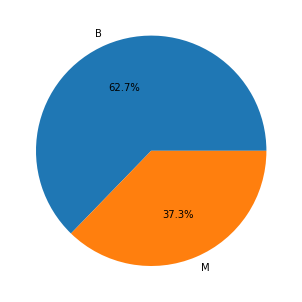

```python
# importing libraries
import numpy as np
import pandas as pd
import matplotlib.pyplot as plt
import seaborn as sns
import copy
```


```python
# we want to look at the plotted figures in the notebook
%matplotlib inline
```


```python
df = pd.read_csv('data.csv')
df.head()
```


<div>
<style scoped>
    .dataframe tbody tr th:only-of-type {
        vertical-align: middle;
    }

    .dataframe tbody tr th {
        vertical-align: top;
    }

    .dataframe thead th {
        text-align: right;
    }
</style>
<table border="1" class="dataframe">
  <thead>
    <tr style="text-align: right;">
      <th></th>
      <th>id</th>
      <th>diagnosis</th>
      <th>radius_mean</th>
      <th>texture_mean</th>
      <th>perimeter_mean</th>
      <th>area_mean</th>
      <th>smoothness_mean</th>
      <th>compactness_mean</th>
      <th>concavity_mean</th>
      <th>concave points_mean</th>
      <th>...</th>
      <th>radius_worst</th>
      <th>texture_worst</th>
      <th>perimeter_worst</th>
      <th>area_worst</th>
      <th>smoothness_worst</th>
      <th>compactness_worst</th>
      <th>concavity_worst</th>
      <th>concave points_worst</th>
      <th>symmetry_worst</th>
      <th>fractal_dimension_worst</th>
    </tr>
  </thead>
  <tbody>
    <tr>
      <th>0</th>
      <td>842302</td>
      <td>M</td>
      <td>17.99</td>
      <td>10.38</td>
      <td>122.80</td>
      <td>1001.0</td>
      <td>0.11840</td>
      <td>0.27760</td>
      <td>0.3001</td>
      <td>0.14710</td>
      <td>...</td>
      <td>25.38</td>
      <td>17.33</td>
      <td>184.60</td>
      <td>2019.0</td>
      <td>0.1622</td>
      <td>0.6656</td>
      <td>0.7119</td>
      <td>0.2654</td>
      <td>0.4601</td>
      <td>0.11890</td>
    </tr>
    <tr>
      <th>1</th>
      <td>842517</td>
      <td>M</td>
      <td>20.57</td>
      <td>17.77</td>
      <td>132.90</td>
      <td>1326.0</td>
      <td>0.08474</td>
      <td>0.07864</td>
      <td>0.0869</td>
      <td>0.07017</td>
      <td>...</td>
      <td>24.99</td>
      <td>23.41</td>
      <td>158.80</td>
      <td>1956.0</td>
      <td>0.1238</td>
      <td>0.1866</td>
      <td>0.2416</td>
      <td>0.1860</td>
      <td>0.2750</td>
      <td>0.08902</td>
    </tr>
    <tr>
      <th>2</th>
      <td>84300903</td>
      <td>M</td>
      <td>19.69</td>
      <td>21.25</td>
      <td>130.00</td>
      <td>1203.0</td>
      <td>0.10960</td>
      <td>0.15990</td>
      <td>0.1974</td>
      <td>0.12790</td>
      <td>...</td>
      <td>23.57</td>
      <td>25.53</td>
      <td>152.50</td>
      <td>1709.0</td>
      <td>0.1444</td>
      <td>0.4245</td>
      <td>0.4504</td>
      <td>0.2430</td>
      <td>0.3613</td>
      <td>0.08758</td>
    </tr>
    <tr>
      <th>3</th>
      <td>84348301</td>
      <td>M</td>
      <td>11.42</td>
      <td>20.38</td>
      <td>77.58</td>
      <td>386.1</td>
      <td>0.14250</td>
      <td>0.28390</td>
      <td>0.2414</td>
      <td>0.10520</td>
      <td>...</td>
      <td>14.91</td>
      <td>26.50</td>
      <td>98.87</td>
      <td>567.7</td>
      <td>0.2098</td>
      <td>0.8663</td>
      <td>0.6869</td>
      <td>0.2575</td>
      <td>0.6638</td>
      <td>0.17300</td>
    </tr>
    <tr>
      <th>4</th>
      <td>84358402</td>
      <td>M</td>
      <td>20.29</td>
      <td>14.34</td>
      <td>135.10</td>
      <td>1297.0</td>
      <td>0.10030</td>
      <td>0.13280</td>
      <td>0.1980</td>
      <td>0.10430</td>
      <td>...</td>
      <td>22.54</td>
      <td>16.67</td>
      <td>152.20</td>
      <td>1575.0</td>
      <td>0.1374</td>
      <td>0.2050</td>
      <td>0.4000</td>
      <td>0.1625</td>
      <td>0.2364</td>
      <td>0.07678</td>
    </tr>
  </tbody>
</table>
<p>5 rows × 32 columns</p>
</div>


```python
column = df.columns
column
```


    Index(['id', 'diagnosis', 'radius_mean', 'texture_mean', 'perimeter_mean',
           'area_mean', 'smoothness_mean', 'compactness_mean', 'concavity_mean',
           'concave points_mean', 'symmetry_mean', 'fractal_dimension_mean',
           'radius_se', 'texture_se', 'perimeter_se', 'area_se', 'smoothness_se',
           'compactness_se', 'concavity_se', 'concave points_se', 'symmetry_se',
           'fractal_dimension_se', 'radius_worst', 'texture_worst',
           'perimeter_worst', 'area_worst', 'smoothness_worst',
           'compactness_worst', 'concavity_worst', 'concave points_worst',
           'symmetry_worst', 'fractal_dimension_worst'],
          dtype='object')


```python
len(df['id'].unique()) == len(df.index)
# which means that all id values are unique (as expected)
# we may ignore that column
```


    True


```python
df['diagnosis'].unique()
# M = malignant, B = benign
```


    array(['M', 'B'], dtype=object)


```python
df.info()
# diagnosis is categorical data
```

    <class 'pandas.core.frame.DataFrame'>
    RangeIndex: 569 entries, 0 to 568
    Data columns (total 32 columns):
     #   Column                   Non-Null Count  Dtype  
    ---  ------                   --------------  -----  
     0   id                       569 non-null    int64  
     1   diagnosis                569 non-null    object 
     2   radius_mean              569 non-null    float64
     3   texture_mean             569 non-null    float64
     4   perimeter_mean           569 non-null    float64
     5   area_mean                569 non-null    float64
     6   smoothness_mean          569 non-null    float64
     7   compactness_mean         569 non-null    float64
     8   concavity_mean           569 non-null    float64
     9   concave points_mean      569 non-null    float64
     10  symmetry_mean            569 non-null    float64
     11  fractal_dimension_mean   569 non-null    float64
     12  radius_se                569 non-null    float64
     13  texture_se               569 non-null    float64
     14  perimeter_se             569 non-null    float64
     15  area_se                  569 non-null    float64
     16  smoothness_se            569 non-null    float64
     17  compactness_se           569 non-null    float64
     18  concavity_se             569 non-null    float64
     19  concave points_se        569 non-null    float64
     20  symmetry_se              569 non-null    float64
     21  fractal_dimension_se     569 non-null    float64
     22  radius_worst             569 non-null    float64
     23  texture_worst            569 non-null    float64
     24  perimeter_worst          569 non-null    float64
     25  area_worst               569 non-null    float64
     26  smoothness_worst         569 non-null    float64
     27  compactness_worst        569 non-null    float64
     28  concavity_worst          569 non-null    float64
     29  concave points_worst     569 non-null    float64
     30  symmetry_worst           569 non-null    float64
     31  fractal_dimension_worst  569 non-null    float64
    dtypes: float64(30), int64(1), object(1)
    memory usage: 142.4+ KB
    


```python
y = df['diagnosis']
x = df['radius_mean']
sns.boxplot(x, y)
```


    <matplotlib.axes._subplots.AxesSubplot at 0x1568d7757c8>


```python
fig, axes = plt.subplots(10, 3, figsize=(15,50))

c = np.reshape(column[2:], (10, 3))

for i in range(10):
    for j in range(3):
        sns.boxplot(df[column[1]], df[c[i][j]], ax = axes[i, j])
        
fig.savefig('boxplot.png', bbox_inches = 'tight')
```


```python
column
```


    Index(['id', 'diagnosis', 'radius_mean', 'texture_mean', 'perimeter_mean',
           'area_mean', 'smoothness_mean', 'compactness_mean', 'concavity_mean',
           'concave points_mean', 'symmetry_mean', 'fractal_dimension_mean',
           'radius_se', 'texture_se', 'perimeter_se', 'area_se', 'smoothness_se',
           'compactness_se', 'concavity_se', 'concave points_se', 'symmetry_se',
           'fractal_dimension_se', 'radius_worst', 'texture_worst',
           'perimeter_worst', 'area_worst', 'smoothness_worst',
           'compactness_worst', 'concavity_worst', 'concave points_worst',
           'symmetry_worst', 'fractal_dimension_worst'],
          dtype='object')


```python
cat_df = df.select_dtypes(include=['object']).copy()
cat_df.head()
```


<div>
<style scoped>
    .dataframe tbody tr th:only-of-type {
        vertical-align: middle;
    }

    .dataframe tbody tr th {
        vertical-align: top;
    }

    .dataframe thead th {
        text-align: right;
    }
</style>
<table border="1" class="dataframe">
  <thead>
    <tr style="text-align: right;">
      <th></th>
      <th>diagnosis</th>
    </tr>
  </thead>
  <tbody>
    <tr>
      <th>0</th>
      <td>M</td>
    </tr>
    <tr>
      <th>1</th>
      <td>M</td>
    </tr>
    <tr>
      <th>2</th>
      <td>M</td>
    </tr>
    <tr>
      <th>3</th>
      <td>M</td>
    </tr>
    <tr>
      <th>4</th>
      <td>M</td>
    </tr>
  </tbody>
</table>
</div>


```python
cat = cat_df['diagnosis'].value_counts()
fig = plt.figure(figsize = (9, 9))
ax = fig.add_axes([0, 0, 0.5, 0.5])
x = cat.index
y = cat.values
sns.barplot(x, y, ax = ax)
ax.set_title("Diagnosis frequency count")
ax.set_xlabel('Diagnosis')
ax.set_ylabel('Frequency')
fig.savefig('diagnosis_barplot.png', bbox_inches = 'tight')
# print(cat_df['diagnosis'].value_counts().count())
```


```python
labels = cat.index.tolist()
sizes = cat.values.tolist()

fig = plt.figure()
ax = fig.add_axes([0, 0, 1, 1])
ax.pie(sizes, labels=labels, autopct='%1.1f%%')
fig.savefig('diagnosis_piechart.png')
```





```python
groups = []

for i in range (2, 12):
    l = []
    for j in range(3):
        l.append(column[i + j*10])
    l.append(column[1])
    groups.append(l)
```


```python
radius = df[groups[0]]
fig = plt.figure()
fig = sns.pairplot(radius, hue='diagnosis', markers=["o", "s"],height=4)
fig.savefig('radius_pairplot.png', bbox_inches = 'tight')
```


    <Figure size 432x288 with 0 Axes>


```python
texture = df[groups[1]]
fig = plt.figure()
fig = sns.pairplot(texture, hue='diagnosis', markers=["o", "s"],height=4)
fig.savefig('texture_pairplot.png', bbox_inches = 'tight')
```


    <Figure size 432x288 with 0 Axes>


```python
perimeter = df[groups[2]]
fig = plt.figure()
fig = sns.pairplot(perimeter, hue='diagnosis', markers=["o", "s"],height=4)
fig.savefig('perimeter_pairplot.png', bbox_inches = 'tight')
```


    <Figure size 432x288 with 0 Axes>


```python
area = df[groups[3]]
fig = plt.figure()
fig = sns.pairplot(area, hue='diagnosis', markers=["o", "s"],height=4)
fig.savefig('area_pairplot.png', bbox_inches = 'tight')
```


    <Figure size 432x288 with 0 Axes>


```python
smoothness = df[groups[4]]
fig = plt.figure()
fig = sns.pairplot(smoothness, hue='diagnosis', markers=["o", "s"],height=4)
fig.savefig('smoothness_pairplot.png', bbox_inches = 'tight')
```


    <Figure size 432x288 with 0 Axes>


```python
compactness = df[groups[5]]
fig = plt.figure()
fig = sns.pairplot(compactness, hue='diagnosis', markers=["o", "s"],height=4)
fig.savefig('compactness_pairplot.png', bbox_inches = 'tight')
```


    <Figure size 432x288 with 0 Axes>


```python
concavity = df[groups[6]]
fig = plt.figure()
fig = sns.pairplot(concavity, hue='diagnosis', markers=["o", "s"],height=4)
fig.savefig('concavity_pairplot.png', bbox_inches = 'tight')
```


    <Figure size 432x288 with 0 Axes>


```python
concave_points = df[groups[7]]
fig = plt.figure()
fig = sns.pairplot(concave_points, hue='diagnosis', markers=["o", "s"],height=4)
fig.savefig('concave_points_pairplot.png', bbox_inches = 'tight')
```


    <Figure size 432x288 with 0 Axes>


```python
symmetry = df[groups[8]]
fig = plt.figure()
fig = sns.pairplot(symmetry, hue='diagnosis', markers=["o", "s"],height=4)
fig.savefig('symmetry_pairplot.png', bbox_inches = 'tight')
```


    <Figure size 432x288 with 0 Axes>


```python
fractal_dimension = df[groups[9]]
fig = plt.figure()
fig = sns.pairplot(fractal_dimension, hue='diagnosis', markers=["o", "s"],height=4)
fig.savefig('fractal_dimension_pairplot.png', bbox_inches = 'tight')
```


    <Figure size 432x288 with 0 Axes>


```python
df['diagnosis'].replace({'B' : 0, 'M' : 1}, inplace = True)
df.head()
```


<div>
<style scoped>
    .dataframe tbody tr th:only-of-type {
        vertical-align: middle;
    }

    .dataframe tbody tr th {
        vertical-align: top;
    }

    .dataframe thead th {
        text-align: right;
    }
</style>
<table border="1" class="dataframe">
  <thead>
    <tr style="text-align: right;">
      <th></th>
      <th>id</th>
      <th>diagnosis</th>
      <th>radius_mean</th>
      <th>texture_mean</th>
      <th>perimeter_mean</th>
      <th>area_mean</th>
      <th>smoothness_mean</th>
      <th>compactness_mean</th>
      <th>concavity_mean</th>
      <th>concave points_mean</th>
      <th>...</th>
      <th>radius_worst</th>
      <th>texture_worst</th>
      <th>perimeter_worst</th>
      <th>area_worst</th>
      <th>smoothness_worst</th>
      <th>compactness_worst</th>
      <th>concavity_worst</th>
      <th>concave points_worst</th>
      <th>symmetry_worst</th>
      <th>fractal_dimension_worst</th>
    </tr>
  </thead>
  <tbody>
    <tr>
      <th>0</th>
      <td>842302</td>
      <td>1</td>
      <td>17.99</td>
      <td>10.38</td>
      <td>122.80</td>
      <td>1001.0</td>
      <td>0.11840</td>
      <td>0.27760</td>
      <td>0.3001</td>
      <td>0.14710</td>
      <td>...</td>
      <td>25.38</td>
      <td>17.33</td>
      <td>184.60</td>
      <td>2019.0</td>
      <td>0.1622</td>
      <td>0.6656</td>
      <td>0.7119</td>
      <td>0.2654</td>
      <td>0.4601</td>
      <td>0.11890</td>
    </tr>
    <tr>
      <th>1</th>
      <td>842517</td>
      <td>1</td>
      <td>20.57</td>
      <td>17.77</td>
      <td>132.90</td>
      <td>1326.0</td>
      <td>0.08474</td>
      <td>0.07864</td>
      <td>0.0869</td>
      <td>0.07017</td>
      <td>...</td>
      <td>24.99</td>
      <td>23.41</td>
      <td>158.80</td>
      <td>1956.0</td>
      <td>0.1238</td>
      <td>0.1866</td>
      <td>0.2416</td>
      <td>0.1860</td>
      <td>0.2750</td>
      <td>0.08902</td>
    </tr>
    <tr>
      <th>2</th>
      <td>84300903</td>
      <td>1</td>
      <td>19.69</td>
      <td>21.25</td>
      <td>130.00</td>
      <td>1203.0</td>
      <td>0.10960</td>
      <td>0.15990</td>
      <td>0.1974</td>
      <td>0.12790</td>
      <td>...</td>
      <td>23.57</td>
      <td>25.53</td>
      <td>152.50</td>
      <td>1709.0</td>
      <td>0.1444</td>
      <td>0.4245</td>
      <td>0.4504</td>
      <td>0.2430</td>
      <td>0.3613</td>
      <td>0.08758</td>
    </tr>
    <tr>
      <th>3</th>
      <td>84348301</td>
      <td>1</td>
      <td>11.42</td>
      <td>20.38</td>
      <td>77.58</td>
      <td>386.1</td>
      <td>0.14250</td>
      <td>0.28390</td>
      <td>0.2414</td>
      <td>0.10520</td>
      <td>...</td>
      <td>14.91</td>
      <td>26.50</td>
      <td>98.87</td>
      <td>567.7</td>
      <td>0.2098</td>
      <td>0.8663</td>
      <td>0.6869</td>
      <td>0.2575</td>
      <td>0.6638</td>
      <td>0.17300</td>
    </tr>
    <tr>
      <th>4</th>
      <td>84358402</td>
      <td>1</td>
      <td>20.29</td>
      <td>14.34</td>
      <td>135.10</td>
      <td>1297.0</td>
      <td>0.10030</td>
      <td>0.13280</td>
      <td>0.1980</td>
      <td>0.10430</td>
      <td>...</td>
      <td>22.54</td>
      <td>16.67</td>
      <td>152.20</td>
      <td>1575.0</td>
      <td>0.1374</td>
      <td>0.2050</td>
      <td>0.4000</td>
      <td>0.1625</td>
      <td>0.2364</td>
      <td>0.07678</td>
    </tr>
  </tbody>
</table>
<p>5 rows × 32 columns</p>
</div>


```python
colors = ['b', 'g', 'r', 'm', 'k']
fig, axes = plt.subplots(nrows = 5, ncols = 2, figsize = (15, 15))
plt.tight_layout()
data1 = np.reshape(column[2:12], (5, 2))

for i in range(5):
    for j in range(2):
        sns.distplot(df[data1[i][j]], ax = axes[i][j], hist_kws=dict(edgecolor= 'k', linewidth=2), color = np.random.choice(colors))
        
fig.savefig('distplot1.png', bbox_inches = 'tight')
```


```python
colors = ['b', 'g', 'r', 'm', 'k']
fig, axes = plt.subplots(nrows = 5, ncols = 2, figsize = (15, 15))
plt.tight_layout()
data2 = np.reshape(column[12:22], (5, 2))

for i in range(5):
    for j in range(2):
        sns.distplot(df[data2[i][j]], ax = axes[i][j], hist_kws=dict(edgecolor= 'k', linewidth=2), color = np.random.choice(colors))
        
fig.savefig('distplot2.png', bbox_inches = 'tight')
```


```python
colors = ['b', 'g', 'r', 'm', 'k']
fig, axes = plt.subplots(nrows = 5, ncols = 2, figsize = (15, 15))
plt.tight_layout()
data3 = np.reshape(column[22:32], (5, 2))

for i in range(5):
    for j in range(2):
        sns.distplot(df[data3[i][j]], ax = axes[i][j], hist_kws=dict(edgecolor= 'k', linewidth=2), color = np.random.choice(colors))
        
fig.savefig('distplot3.png', bbox_inches = 'tight')
```


```python
df1 = df.drop(columns = ['id'])
```


```python
fig = plt.figure(figsize = (20, 20))
ax = fig.add_axes([0, 0, 1, 1])
sns.heatmap(df1, ax = ax)
fig.savefig('heatmap.png', bbox_inches = 'tight')
```


```python
correlation = df1.corr()
# correlation matrix of the dataset
fig = plt.figure(figsize = (17, 17))
ax = fig.add_axes([0, 0, 1, 1])
sns.heatmap(correlation, ax = ax, square = True, annot = True, linecolor = 'w')
fig.savefig('correlation_heatmap.png', bbox_inches = 'tight')
```


```python
fig = plt.figure(figsize = (15, 10))
ax = fig.add_axes([0, 0, 1, 1])
sns.scatterplot(x = 'radius_mean', y = 'area_mean', data = df1, hue = 'diagnosis', ax = ax)
ax.set_title('radius_mean v/s area_mean bivariate analysis using scatter plot')
fig.savefig('scatterplot.png', bbox_inches = 'tight')
```


```python
fig = plt.figure(figsize = (17, 7))
ax = fig.add_axes([0, 0, 1, 1])
sns.lineplot(x = 'texture_mean', y = 'smoothness_mean', data = df1, hue = 'diagnosis', ax = ax)
ax.set_title('texture_mean v/s smoothness_mean bivariate analysis using line plot')
fig.savefig('lineplot.png', bbox_inches = 'tight')
```


```python
fig = plt.figure(figsize = (15, 10))
fig = sns.jointplot(x = 'concavity_mean', y = 'symmetry_mean', data = df1)
fig.savefig('jointplot.png', bbox_inches = 'tight')
```


    <Figure size 1080x720 with 0 Axes>


```python
fig = plt.figure(figsize = (10, 7))
ax = fig.add_axes([0, 0, 1, 1])
df['fractal_dimension_mean'].hist(ax = ax)
ax.set_xlabel('fractal_dimension_mean')
ax.set_title('univariate analysis of fractal_dimension_mean using histogram')
fig.savefig('histplot.png', bbox_inches = 'tight')
```


```python
fig = plt.figure(figsize = (10, 7))
ax = fig.add_axes([0, 0, 1, 1])
df['compactness_mean'].plot.kde(ax = ax)
ax.set_xlabel('compactness_mean')
ax.set_title('univariate analysis of compactness_mean using kernel density estimation plot')
fig.savefig('kdeplot.png', bbox_inches = 'tight')
```


```python
from mpl_toolkits.mplot3d import Axes3D 
```


```python
fig = plt.figure(figsize = (10, 7)) 
axes = fig.gca(projection ='3d') 
axes.plot_trisurf(df1['radius_mean'], df1['perimeter_mean'], df1['area_mean']) 
fig.savefig('surfaceplot.png', bbox_inches = 'tight')
```


```python
fig = plt.figure(figsize = (8, 5))
ax = fig.add_axes([0, 0, 1, 1])
sns.kdeplot(df['concavity_mean'], df['fractal_dimension_mean'], ax = ax)
ax.set_title('Contour plot')
fig.savefig('contourplot.png', bbox_inches = 'tight')
```


```python
fig = plt.figure(figsize = (10, 7))
axes = fig.add_axes([0, 0, 1, 1])
sns.violinplot(x='diagnosis', y='compactness_mean', data=df, hue='diagnosis', ax = axes)
axes.set_title('Violin Plot')
fig.savefig('violinplot.png', bbox_inches = 'tight')
```


```python
fig = plt.figure(figsize = (10, 10))
fig = sns.lmplot(x='area_mean', y='compactness_mean', data=df, hue='diagnosis')
fig.savefig('lmplot.png', bbox_inches = 'tight')
```


    <Figure size 720x720 with 0 Axes>


```python
g = sns.FacetGrid(df1, col = 'diagnosis')
g.map_dataframe(sns.scatterplot, x = 'concave points_mean', y = 'concavity_mean')
g.savefig('FacetGridplot.png')
```


```python
phi = pd.plotting.scatter_matrix(df1[column[1:12]], figsize = (25, 25))
```


```python

```
